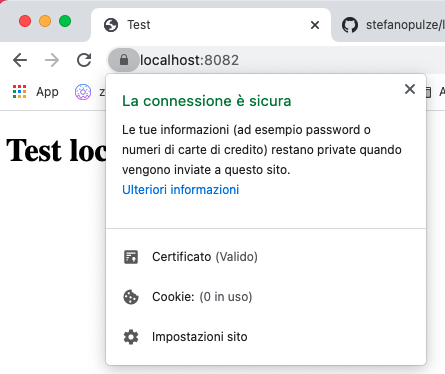

# Self Signed Certificate




## Certificate authority (CA)

Generate `RootCA.pem`, `RootCA.key` & `RootCA.crt`:

```bash
openssl req -x509 -nodes -new -sha256 -days 1024 -newkey rsa:2048 -keyout RootCA.key -out RootCA.pem -subj "/C=IT/CN=StefanoNetwork-Root-CA"
openssl x509 -outform pem -in RootCA.pem -out RootCA.crt
```

#### Trust Root CA
MacOS Keychain

```bash
sudo security add-trusted-cert -d -k /Library/Keychains/System.keychain RootCA.pem
```

##### Tips

- If you have some problem with Google Chrome try `chrome://restart` in url bar


## Domain name certificate

First, create a file `domains.ext` that lists all your local domains:

```
authorityKeyIdentifier=keyid,issuer
basicConstraints=CA:FALSE
keyUsage = digitalSignature, nonRepudiation, keyEncipherment, dataEncipherment
subjectAltName = @alt_names
[alt_names]
DNS.1 = localhost
DNS.2 = fake1.local
DNS.3 = fake2.local
```

Generate `localhost.key`, `localhost.csr`, and `localhost.crt`:

```bash
openssl req -new -nodes -newkey rsa:2048 -keyout localhost.key -out localhost.csr -subj "/C=IT/ST=Italy/L=Padova/O=Stefano/CN=localhost"
openssl x509 -req -sha256 -days 365 -in localhost.csr -CA RootCA.pem -CAkey RootCA.key -CAcreateserial -extfile domains.ext -out localhost.crt
```


## Test

You can test https with all your favorites http-server.

If you want test with http-server js
```bash
npm install --global http-server
http-server --ssl --cert localhost.crt --key localhost.key test
```

